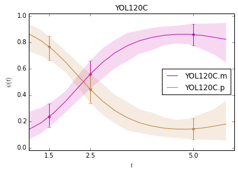
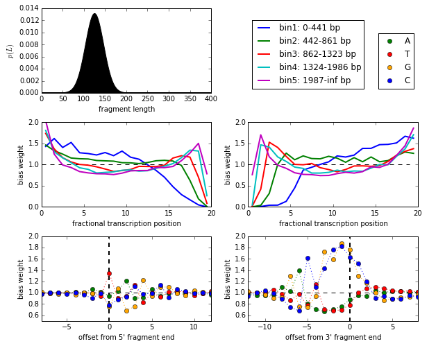
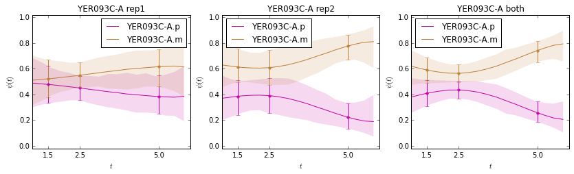

Tutorial of DICEseq analysis
============================

This tutorial is to show how to use the DICEseq results for analysis,
mainly focus on visualize the results. The IPython notebook is availble
here_.

.. _here: https://github.com/huangyh09/diceseq/blob/master/tutorials/diceseq_tutorial.ipynb

**Note**: although the examples here are only from yeast with two isoforms,
this tool is designed for genes with any number of isoforms.

1. Visualizing isoform dynamics with Gaussian process
-----------------------------------------------------

This plot is packaged in the diceseq into an object ``SampleFile`` in
the file `out_utils.py`_.
From the base plot, you could also customize the figure, e.g., change
the axis label, title.

.. _`out_utils.py`: https://github.com/huangyh09/diceseq/blob/master/diceseq/utils/out_utils.py

**Note**: in order to visualize the Gaussian process, you need to add the
argument ``--sample_num=500`` when running ``diceseq``. The default is
0, so that there is no output file for sampling, i.e., xx.sample.gz. We
suggest setting it as 500, but you could choose other number of samples.

.. code:: python

    import numpy as np
    import pylab as pl
    import matplotlib
    from diceseq import SampleFile
    % matplotlib inline
    
    # load the data
    sample_file = "../data/out/joint.sample.gz"
    Sample = SampleFile(sample_file)
    
    # set arguments for GP_visual
    gene_in = Sample.gene[2]     # "YOL120C"
    T = np.array([1.5, 2.5, 5])  # orignal time
    xx = np.arange(1,6,0.3)      # time region for prediction
    _theta = None                # use learned thetas; or set others: [theta1, theta2], e.g., [3.0, 5]
    
    # plot the Gaussian process
    fig = pl.figure()
    Sample.GP_visual(gene_in, T, xx, _theta)
    
    fig.set_size_inches(6,4)
    #fig.savefig("../out/test.png", dpi=300, bbox_inches='tight')
    pl.show()

2. Plot the bias parameters
---------------------------

This plot is packaged in the diceseq into an object ``BiasFile`` in the
file `bias_utils.py`_. From the base plot, you could also customize the figure, e.g., change
the axis label, title.

.. _`bias_utils.py`: https://github.com/huangyh09/diceseq/blob/master/diceseq/utils/out_utils.py

**Note**: in order to get the xx.bias file, you need to run ``dice-bias``
first, which estimate the parameters from the single-isoform genes.
Please ensure sufficient single-isoform genes exist in the annotation
file.

.. code:: python

    import numpy as np
    import pylab as pl
    import matplotlib
    from diceseq import BiasFile
    % matplotlib inline
    
    # load the data
    bias_file = "../data/bias/yeast_4tU.bias"
    Bias = BiasFile(bias_file)
    
    # plot the bias parameters
    fig = pl.figure()
    pl.subplot(3,2,1)
    Bias.plot_bias(mode="flen")
    pl.subplot(3,2,2)
    Bias.plot_bias(mode="legend")
    pl.subplot(3,2,3)
    Bias.plot_bias(mode="pos5")
    pl.legend().set_visible(False)
    pl.subplot(3,2,4)
    Bias.plot_bias(mode="pos3")
    pl.legend().set_visible(False)
    pl.subplot(3,2,5)
    Bias.plot_bias(mode="seq5")
    pl.legend().set_visible(False)
    pl.subplot(3,2,6)
    Bias.plot_bias(mode="seq3")
    pl.legend().set_visible(False)
    
    fig.set_size_inches(9,7)
    fig.tight_layout()
    # fig.savefig("../data/bias/test.png", dpi=300, bbox_inches='tight')
    pl.show()

3. Differential splicing by Bayes factor
----------------------------------------

As this part hasn't been included in the DICEseq paper, we add more
introduction here.

In addition to estimating isoform proportions, DICEseq also permits to
identify differential splicing dynamics between two conditions by using
the Bayse factor (BF), which has been used to detect the differential
isoform at a single point [1] and also for differential dynamics of
expression level [2]. Here, the null model, :math:`M_0`, denotes that
the splicing dynamics in two conditions are the same, where we merge the
two data sets and fit a single model. The alternative model,
:math:`M_1`, denotes that the splicing dynamics in two conditions are
different, where we fit different models for the two data sets. Assuming
equal prior for :math:`M_0` and :math:`M_1`, the BF supporting the
alternative model :math:`M_1` is calculated asfollows,

:math:`BF =\frac {p(R|M_1)} {p(R|M_0)}`

where the marginal likelihood :math:`p(R|M_i),i ∈ \{0,1\}` is estimated
from the harmonic mean of n likelihoods of the MCMC samples following
the posterior distribution, as described in [3], as follows,

:math:`p(R|\mathcal{M}) = \frac {n} {\sum_{j=1}^n {p(R|\Psi^{(j)}, \Theta^{(j)})^{-1}}}`

As suggested by Jeffreys [4], BF > 10 is a strong evidence supporting
the alternative model :math:`M_1` over the null model :math:`M_0`, which
is taken as a threshold in this work.

**Note**: we plan to further extend this differential dynamics detection
methods in near feature, e.g., by taking into account the replicates,
and comparing with other methods.

[1] Katz, Y., Wang, E. T., Airoldi, E. M., and Burge, C. B. (2010)
Analysis and design of RNA sequencing experiments for identifying
isoform regulation. Nature Methods, 7(12), 1009–1015.

[2] Aijo, T., Butty, V., Chen, Z., Salo, V., Tripathi, S., Burge, C. B.,
Lahesmaa, R., and L ahdesm aki, H. (2014) Methods for time series
analysis of RNA-seq data with application to human Th17 cell
differentiation. Bioinformatics, 30(12), i113–i120.

[3] Newton, M. A. and Raftery, A. E. (1994) Approximate Bayesian
inference with the weighted likelihood bootstrap. Journal of the Royal
Statistical Society. Series B (Methodological), pp. 3–48.

[4] Jeffreys, H. Theory of Probability, 3rd revised 1967 edition,
reprinted in Oxford Classics Series. (1998).

**Note**: In order to get the Bayes factor, we need to run ``diceseq`` for 3
times: case1, case2 (M1) and case1+case2 (M0).

::

  diceseq --anno_file=$anno_file --sam_list=case1_t1---case1_t2 --out_file=case1 --sample_num=500

  diceseq --anno_file=$anno_file --sam_list=case2_t1---case2_t2 --out_file=case2 --sample_num=500

  diceseq --anno_file=$anno_file --sam_list=case1_t1,case2_t1---case1_t2,case2_t2 --out_file=both --sample_num=500

.. code:: python

    import numpy as np
    import pylab as pl
    import matplotlib
    from diceseq import SampleFile
    % matplotlib inline
    
    # load the data
    dice_data0 = np.loadtxt("../data/diff/4tUseq_both.dice", dtype="str", delimiter="\t", skiprows=1)
    dice_data1 = np.loadtxt("../data/diff/4tUseq_rep1.dice", dtype="str", delimiter="\t", skiprows=1)
    dice_data2 = np.loadtxt("../data/diff/4tUseq_rep2.dice", dtype="str", delimiter="\t", skiprows=1)
    
    sample0 = SampleFile("../data/diff/4tUseq_both.sample.gz")
    sample1 = SampleFile("../data/diff/4tUseq_rep1.sample.gz")
    sample2 = SampleFile("../data/diff/4tUseq_rep2.sample.gz")
    
    gene_use = ["YOL120C", "YDR471W", "YNL246W", "YER093C-A"]
    
    for g in gene_use:          # sample0.gene:
        idx0 = np.where(dice_data0[:,1] == g)[0][0]
        idx1 = np.where(dice_data1[:,1] == g)[0][0]
        idx2 = np.where(dice_data2[:,1] == g)[0][0]
        logLik0 = dice_data0[idx0,2].astype(float)
        logLik1 = dice_data2[idx1,2].astype(float)
        logLik2 = dice_data2[idx2,2].astype(float)
        BF = np.exp(logLik1+logLik2-logLik0)
        print("%s's BF=%.2e. \tlogLik1:%.1e\tlogLik2:%.1e\tlogLik0:%.1e" %(g, BF, logLik1,logLik2,logLik0))
    print("\n")
    
    # set arguments for GP_visual
    gene_in = "YER093C-A"        # sample1.gene[0] or "YOL120C"
    T = np.array([1.5, 2.5, 5])  # orignal time
    xx = np.arange(1,6,0.3)      # time region for prediction
    _theta = None                # use learned thetas; or set others: [theta1, theta2], e.g., [3.0, 5]
    
    # plot the Gaussian process
    fig = pl.figure()
    pl.subplot(1,3,1)
    sample1.GP_visual(gene_in, T, xx, _theta)
    pl.title("%s rep1" %gene_in)
    
    pl.subplot(1,3,2)
    sample2.GP_visual(gene_in, T, xx, _theta)
    pl.title("%s rep2" %gene_in)
    
    pl.subplot(1,3,3)
    sample0.GP_visual(gene_in, T, xx, _theta)
    pl.title("%s both" %gene_in)
    
    fig.set_size_inches(14,3.5)
    #fig.savefig("../out/test.png", dpi=300, bbox_inches='tight')
    pl.show()

.. parsed-literal::

    YOL120C's BF=inf.   logLik1:-3.9e+04    logLik2:-1.7e+05    logLik0:-2.8e+05
    YDR471W's BF=inf.   logLik1:-3.7e+03    logLik2:-8.6e+04    logLik0:-1.1e+05
    YNL246W's BF=5.15e-131.     logLik1:-5.3e+03    logLik2:-1.6e+04    logLik0:-2.1e+04
    YER093C-A's BF=5.22e+173.   logLik1:-2.3e+03    logLik2:-5.5e+03    logLik0:-8.2e+03
    
    

